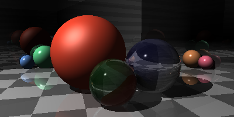

# cs__xunit__dotnet

    
Table of Contents

    <ol>
        <li><a href="#goals">Goals</a>
            <ul>
                <li><a href="#about">About</li>
                <li><a href="#preview">Preview</li>
            </ul>
        </li>
        <li><a href="#methodology">Methodology</li>
          <ul>
            <li><a href="#requirements">Requirements</li>
            <li><a href="#design">Design</li>
            <li><a href="#tools">Tools</li>
            <li><a href="#roadmap">Roadmap</li>
          </ul>
        </li>
        <li><a href="#usage">Usage</a>
            <ul>
                <li><a href="#setup">Setup</li>
                <li><a href="#run">Run</li>
            </ul>
        </li>
        <li><a href="#acknowledgements">Acknowledgements</li>
    </ol>

## Goals
.NET/C# with xUnit for testing
### About
### Preview

## Methodology
### Requirements
### Design
|-- lib = libraries  
|---|-- ProjectMeta = constants and globals  
|---|-- Config = user secrets  
|---|-- Calculator = coding problems/leetcode solutions  
|---|-- Gilded Rose Kata = refactoring exercise  
|---|-- lib/RayTracer = ray tracer  
### Tools
* C#
* xUnit
* Visual Studio
* Git
* Windows
* Oracle VM VirtualBox
* Xubuntu (Ubuntu/Linux)
### Roadmap
## Usage
### Setup
- [ ] clone repo
- [ ] setup user secrets

### Run

## Acnowledgements
* "Ray Tracer Challenge" by Jamis Buck
* [Project Euler](projecteuler.net)
* GildedRose Kata
* "VisualStudio.gitignore" by Github

(<a href="#readme-top">back to top </a>)

